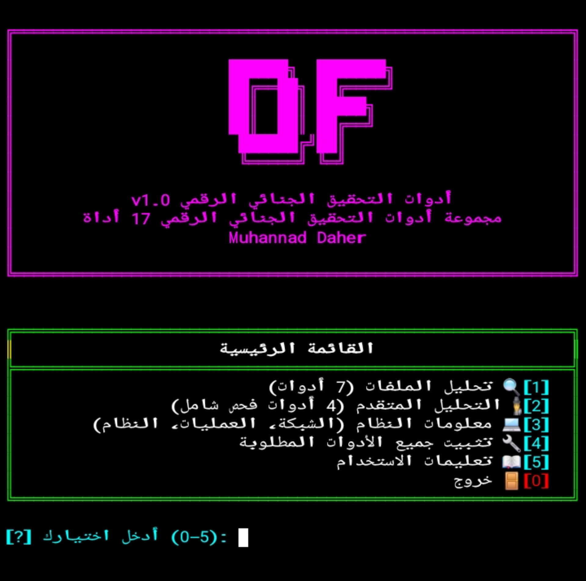
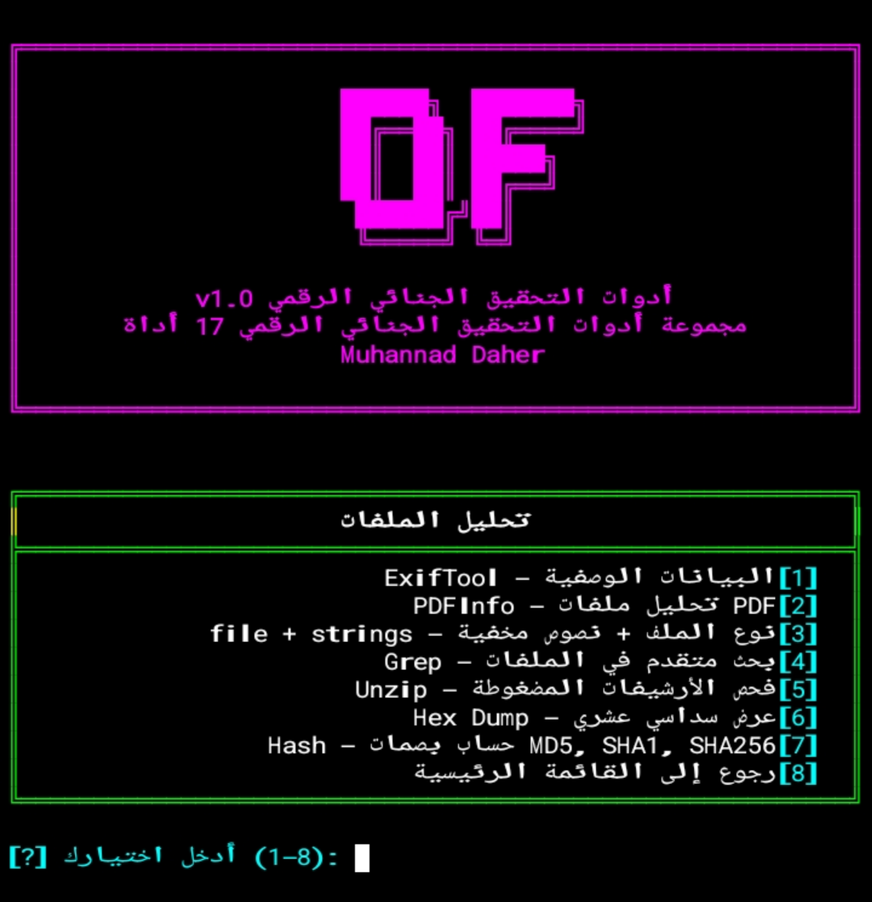
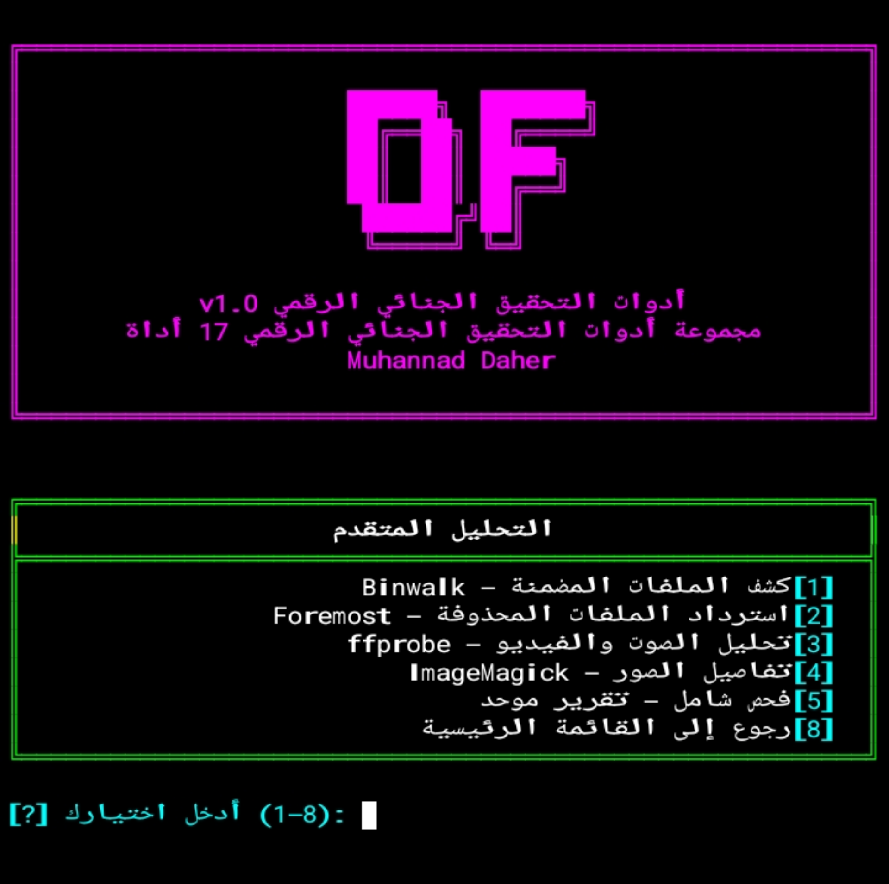
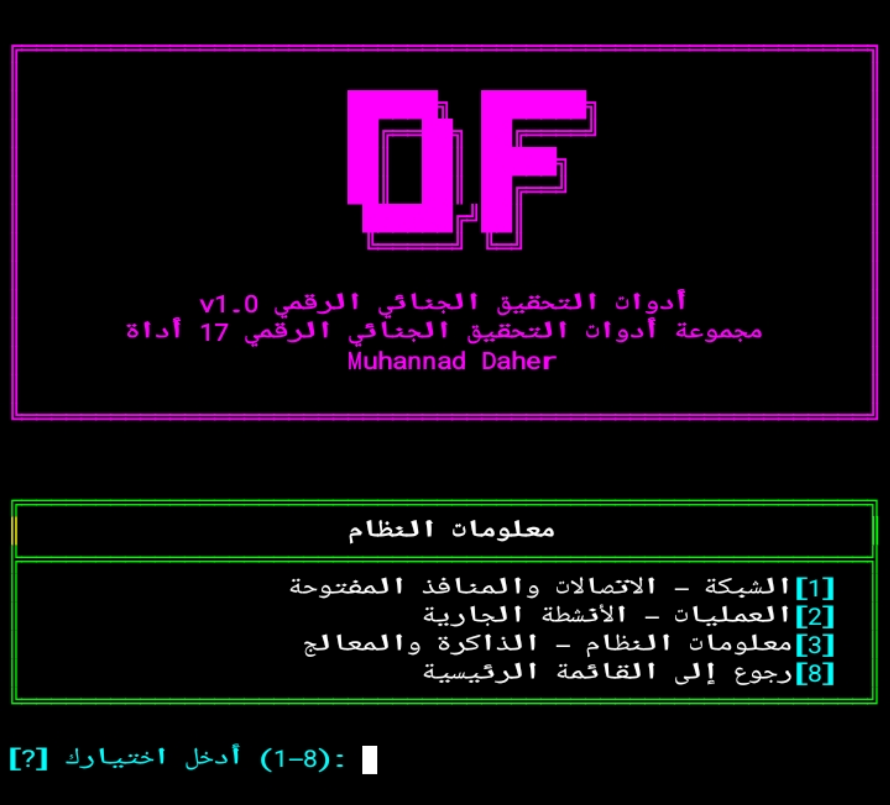
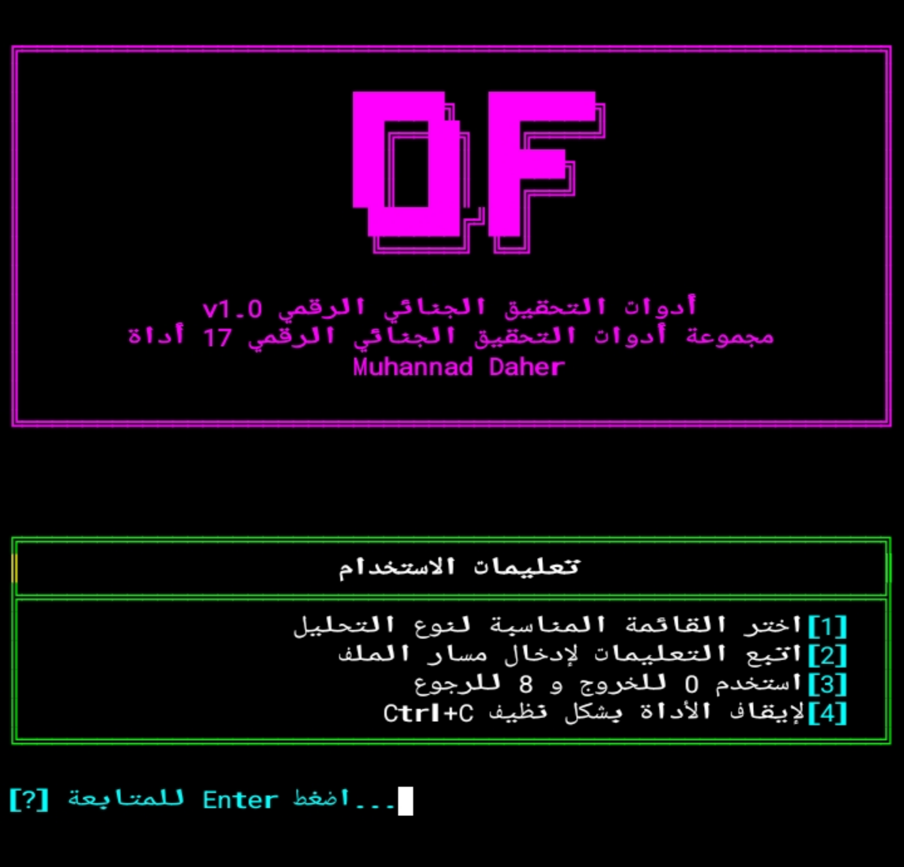

<div align="center">

# 🔬 Digital Forensics Toolkit
# مجموعة أدوات التحقيق الجنائي الرقمي

꧁ঔৣ☬ Muhannad Daher ☬ঔৣ꧂

مجموعة متكاملة من 17 أداة للتحقيق الجنائي الرقمي وتحليل الملفات

---

[](https://github.com/mmuhacker)<br>
<br>
<br>
<br>
<br>
<br>


---

**المحتويات:**

</div>

- [المميزات](#-المميزات)
- [الأدوات المدمجة](#الأدوات-المدمجة)
  - [🔍 تحليل الملفات](#-تحليل-الملفات)
  - [🕵️ التحليل المتقدم](#️-التحليل-المتقدم)
  - [💻 معلومات النظام](#-معلومات-النظام)
- [التثبيت والتشغيل](#-التثبيت-والتشغيل)
  - [تطبيق 🤖 Termux (Android)](#-android--termux)
  - [نظام 🐉 Kali Linux](#-kali-linux)
- [طريقة الاستخدام](#-طريقة-الاستخدام)
- [الأخطاء الشائعة والحلول](#الأخطاء-الشائعة)
- [إنشاء اختصار التشغيل](#-إنشاء-اختصار-التشغيل)
- [إخلاء المسؤولية](#إخلاء-المسؤولية)
- [المطور](#المطور)
- [الرخصة](#-الرخصة)

---

<div align="center">

## ✨ المميزات

</div>

- 🔬 **17 أداة جنائية** في منصة واحدة
- 🖼️ **تحليل الصور** (EXIF، الأبعاد، العمق، الضغط)
- 📄 **تحليل PDF** (عدد الصفحات، المؤلف، التواريخ)
- 🎵 **تحليل الصوت والفيديو** (المدة، codec، bitrate)
- 🔐 **كشف التخفي** (Binwalk للملفات المضمنة)
- 💾 **استرداد الملفات المحذوفة** (Foremost)
- 🔍 **البحث المتقدم** (Grep مع Regex)
- 📊 **بصمات رقمية** (MD5, SHA1, SHA256, SHA512)
- 🌐 **معلومات الشبكة** (الاتصالات النشطة، المنافذ)
- 🖥️ **معلومات النظام** (الذاكرة، المعالج، وقت التشغيل)
- 🎨 **واجهة عربية بالكامل** مع ألوان احترافية
- ⚡ **تثبيت تلقائي** لجميع الأدوات المطلوبة

---

<div align="center">

📷 **القائمة الرئيسية – اختيار نوع التحليل**



<i style="color: var(--color-fg-default);">الشكل 1: القائمة الرئيسية للأداة (تحليل ملفات، متقدم، معلومات النظام)</i>

---

<div align="center" id="الأدوات-المدمجة">

## 🛠️ الأدوات المدمجة

</div>

<div align="center">

### 🔍 تحليل الملفات

| # | الأداة | الوصف |
|---|--------|-------|
| 1 | **ExifTool** | استخراج البيانات الوصفية الكاملة (EXIF) من الصور، PDF، الفيديو، المستندات |
| 2 | **PDFInfo** | تحليل ملفات PDF: عدد الصفحات، المؤلف، تاريخ الإنشاء، الخوارزميات |
| 3 | **file + strings** | تحديد نوع الملف الحقيقي + استخراج النصوص المخفية داخل الملفات الثنائية |
| 4 | **Grep** | بحث متقدم بالنص العادي أو Regex داخل الملفات والمجلدات |
| 5 | **Unzip** | فحص محتويات الأرشيفات المضغوطة واستخراجها |
| 6 | **Hex Dump** | عرض محتوى أي ملف بصيغة Hexadecimal مع الترميز ASCII |
| 7 | **Hash** | حساب بصمات MD5، SHA1، SHA256، SHA512 مع إمكانية المقارنة |

---

📷 **تحليل الملفات – اختيار نوع التحليل**



<i style="color: var(--color-fg-default);">الشكل 2: قائمة تحليل الملفات</i>

---

### 🕵️ التحليل المتقدم

| # | الأداة | الوصف |
|---|--------|-------|
| 8 | **Binwalk** | كشف الملفات المضمنة داخل الفيرمويرات والملفات (Steganography) |
| 9 | **Foremost** | استرداد الملفات المحذوفة من أقراص أو صور نظام الملفات |
| 10 | **ffprobe** | تحليل عميق لملفات الصوت والفيديو والصور (مدة، codec، bitrate، metadata) |
| 11 | **ImageMagick identify** | تفاصيل دقيقة للصور: الأبعاد، العمق، ملف اللون، الضغط |
| 12 | **فحص شامل** | تقرير موحد يجمع كل الأدوات في ملف TXT محفوظ تلقائياً |


📷 **التحليل المتقدم – اختيار نوع التحليل**



<i style="color: var(--color-fg-default);">الشكل 3: قائمة التحليل المتقدم</i>

---

### 💻 معلومات النظام

| # | الأداة | الوصف |
|---|--------|-------|
| 13 | **الشبكة** | الاتصالات النشطة، المنافذ المفتوحة، جدول التوجيه، واجهات الشبكة |
| 14 | **العمليات** | قائمة الأنشطة الجارية مرتبة حسب استهلاك CPU |
| 15 | **معلومات النظام** | بيانات /proc: الذاكرة، المعالج، النواة، وقت التشغيل |
| 16 | **تثبيت الأدوات** | تثبيت تلقائي لجميع الأدوات المطلوبة (Termux/Kali) |


📷 **معلومات النظام – اختيار نوع المعلومات**



<i style="color: var(--color-fg-default);">الشكل 4: إستخراج معلومات النظام</i>

---

📷 **تعليمات الإستخدام**



<i style="color: var(--color-fg-default);">الشكل 5: تعليمات الإستخدام</i>

</div>

<div align="center">

## 🚀 التثبيت والتشغيل

---

### 📱 Android — Termux

</div>

**الخطوة 1 — تحديث النظام وتثبيت Python**
```bash
pkg update && pkg upgrade -y
pkg install python -y
```

الخطوة 2 — تثبيت المكتبات الأساسية

```bash
pip install arabic-reshaper python-bidi
```

الخطوة 3 — تثبيت الخط العربي (للعرض الصحيح)

```bash
curl -L "https://fonts.gstatic.com/s/notonaskharabic/v33/RrQ5bpV-9Dd1b1OAGA6M9PkyDuVBePeKNaxcsss0Y7bwvc-VaA.ttf" -o ~/.termux/font.ttf
termux-reload-settings
```

⚠️ أغلق Termux تماماً وافتحه من جديد بعد تثبيت الخط وتأكد من إغلاقه من قائمة تطبيقات الخلفية

الخطوة 4 — تنزيل الأداة

```bash
curl -o $PREFIX/bin/mud_df.py https://raw.githubusercontent.com/mmuhacker/mud-df/main/mud_df.py
chmod +x $PREFIX/bin/mud_df.py
```

الخطوة 5 — إنشاء اختصار التشغيل

```bash
ln -sf $PREFIX/bin/mud_df.py $PREFIX/bin/df
```

الخطوة 6 — تثبيت الأدوات المطلوبة (من داخل الأداة)

· قم بتشغيل الأداة: df
· اختر [4] من القائمة الرئيسية
· انتظر حتى يكتمل التثبيت

⚡ أو كل شيء في أمر واحد

```bash
pkg update && pkg upgrade -y && pkg install python -y && pip install arabic-reshaper python-bidi && curl -L "https://fonts.gstatic.com/s/notonaskharabic/v33/RrQ5bpV-9Dd1b1OAGA6M9PkyDuVBePeKNaxcsss0Y7bwvc-VaA.ttf" -o ~/.termux/font.ttf && termux-reload-settings && curl -o $PREFIX/bin/mud_df.py https://raw.githubusercontent.com/mmuhacker/mud-df/main/mud_df.py && chmod +x $PREFIX/bin/mud_df.py && ln -sf $PREFIX/bin/mud_df.py $PREFIX/bin/df && echo "تم التثبيت بنجاح! يمكنك الآن تشغيل الأداة بكتابة: df"
```

● أمر التشغيل

```bash
df
```

---

<div align="center">

## 🐉 Kali Linux

</div>

الخطوة 1 — تحديث النظام وتثبيت Python

```bash
sudo apt update && sudo apt upgrade -y
sudo apt install python3 pip -y
```

الخطوة 2 — تثبيت المكتبات الأساسية

```bash
pip3 install arabic-reshaper python-bidi
```

الخطوة 3 — تنزيل الأداة

```bash
sudo curl -o /usr/local/bin/mud_df.py https://raw.githubusercontent.com/mmuhacker/mud-df/main/mud_df.py
sudo chmod +x /usr/local/bin/mud_df.py
```

الخطوة 4 — إنشاء اختصار التشغيل

```bash
sudo ln -sf /usr/local/bin/mud_df.py /usr/local/bin/df
```

الخطوة 5 — تثبيت الأدوات المطلوبة (من داخل الأداة)

· قم بتشغيل الأداة: df
· اختر [4] من القائمة الرئيسية
· انتظر حتى يكتمل التثبيت

● أمر التشغيل

```bash
df
```

---

<div align="center">

## 📖 طريقة الاستخدام

| الخيار | الوظيفة |
|----|----------|
| [1] | 🔍 تحليل الملفات (ExifTool, PDFInfo, strings, file, Grep, Unzip, Hex, Hash) |
| [2] | 🕵️ التحليل المتقدم (Binwalk, Foremost, ffprobe, ImageMagick, فحص شامل) |
| [3] | 💻 معلومات النظام (الشبكة، العمليات، النظام) |
| [4] | 🔧 تثبيت جميع الأدوات المطلوبة |
| [5] | 📖 تعليمات الاستخدام |
| [0] | 🚪 خروج |

</div>

---
**اختصارات مهمة:**

- اضغط 8 للرجوع من القوائم الفرعية
- اضغط Ctrl + C للخروج من الأداة مباشرة من أي مكان

---

<div align="center" id="الأخطاء-الشائعة">

## ⚠️ الأخطاء الشائعة والحلول

</div>

**1. خطأ: exiftool: command not found**

**السبب: الأداة exiftool غير مثبتة**

**الحل:**

**من داخل الأداة، اختر 4 لتثبيت جميع الأدوات المطلوبة**
  
**أو يدوياً:**
  
 **Termux**

```bash
pkg install exiftool -y
```
**Kali Linux**

```bash
sudo apt install exiftool -y
```

**2. خطأ: pdfinfo: command not found**

**السبب:  الأداة pdfinfo غير موجودة**

**الحل:**
**Termux**

```bash
pkg install poppler -y
```

**Kali Linux**

```bash
sudo apt install poppler-utils -y
```

**3. خطأ: binwalk: command not found**

**السبب: الأداة binwalk غير موجودة**

**الحل:**
**Termux**

```bash
pkg install binwalk -y
```

**Kali Linux**

```bash
sudo apt install binwalk -y
```

**4. خطأ: foremost: command not found**

**السبب: الأداة foremost غير موجودة**

**الحل:**
**Termux**

```bash
pkg install foremost -y
```

**Kali Linux**

```bash
sudo apt install foremost -y
```

**5. خطأ: ffprobe: command not found**

**السبب: الأداة ffprobe غير موجودة**

**الحل:**

**Termux**

```bash
pkg install ffmpeg -y
```

**Kali Linux**

```bash
sudo apt install ffmpeg -y
```

**6. خطأ: identify: command not found**

**السبب: الأداة identify غير موجودة**

**الحل:**

**Termux**

```bash
pkg install imagemagick -y
```

**Kali Linux**

```bash
sudo apt install imagemagick -y
```

**7. خطأ: النص العربي معكوس ومتقطع**

**الحل:**

**Termux**

```bash
pip install arabic-reshaper python-bidi
```

**ثم أعد تشغيل Termux وتأكد من إغلاقه من قائمة التطبيقات في الخلفية**

**8. خطأ: Permission denied**

**السبب: عدم تفعيل إذن الوصول للملفات في Termux**

**الحل:**
**Termux**

```bash
termux-setup-storage
cd /sdcard/Download
```

---

<div align="center" id="إنشاء-إختصار-التشغيل">

## 🔧 إنشاء اختصار التشغيل

</div>

Termux:

```bash
ln -sf $PREFIX/bin/mud_df.py $PREFIX/bin/df
```

Kali Linux:

```bash
sudo ln -sf /usr/local/bin/mud_df.py /usr/local/bin/df
```

للتشغيل: اكتب df واضغط Enter

---

<div align="center" id="إخلاء-المسؤولية">

## ⚠️ إخلاء المسؤولية

</div>

**هذه الأداة مخصصة لأغراض تعليمية والتحقيق الجنائي الرقمي في المختبرات الشخصية فقط. استخدامها على أنظمة أو ملفات دون إذن مسبق يُعدّ مخالفاً للقانون.**

---

<div align="center" id="المطور">

## 👨‍ المطور

**Muhannad Daher**

[](https://github.com/mmuhacker)

</div>

---

<div align="center" id="الرخصة">

## 📄 الرخصة

**رخصة الاستخدام والنشر مع منع التعديل** – يُسمح باستخدام الأداة ونشرها بحرية، لكن يُمنع تعديل الكود أو هندسته عكسياً. راجع [الترخيص](https://github.com/mmuhacker/mud-df/blob/main/LICENSE.md) للتفاصيل الكاملة.

</div>
---
<div align="center">
  - 📷 **صور الأداة**
  
  
  
  
  
  

</div>

---

- **مجموعة أدوات التحقيق الجنائي الرقمي (17 أداة)**
- **البيئة: Termux (Android) / Kali Linux**
- **الإصدار: v1.0**

---

<div align="center">

**Madarik Tools — صُنع بالعربية**

⭐ **إذا أعجبتك الأداة، لا تنسَ النجمة!** ⭐

</div>
